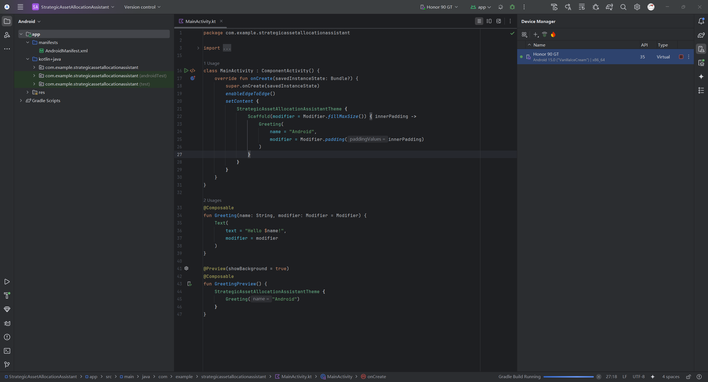

# android studio
android virutal device(AVD)创建流程：
* 在android studio的右边菜单里找到device manager
	* 
* 然后+ -> Create virutal device
	* 注意后续编译时将使用匹配当前设备的sdk级别的sdk，所以这里选个正确的sdk

android studio创建&编译&调试：
* 创建项目：
	* New Project -> Phone and Tablet -> Empty Activity
	* Build Configuration language设为Kotlin DSL
* 编译：
	* 好像不需要额外做啥，运行前会自动编译
* 调试：
	* 先设置好当前设备（创建AVD）
	* 然后按照当前Configuration直接运行/调试即可