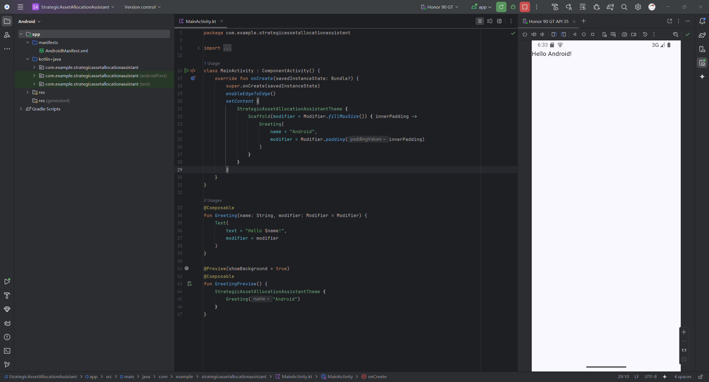

# 战略资产配置助手 - 开发计划

本文档根据需求概述了构建此 Android 应用程序所需的技术栈和分步计划。

## IDE 使用与本地测试

- **本地测试:** 所有开发步骤都将首先在 **Android 模拟器** 上进行测试。你可以通过 **Android Studio 的 AVD Manager** 来创建和管理模拟器，无需实体手机即可在电脑上运行和调试应用。
- **Cursor:** 作为所有编码、重构和 AI 辅助开发的主要 IDE。
- **Android Studio:** 用于其专业工具可提供优势的特定任务，尤其是**管理模拟器**和使用**可视化调试工具**。

---

## 技术栈

- **语言:** **Kotlin**
- **UI 工具包:** **Jetpack Compose**
- **架构:** **MVVM** 结合整洁架构原则
- **异步编程:** **Kotlin Coroutines & Flow**
- **依赖注入:** **Hilt**
- **数据库:** **Room**
- **网络:** **Retrofit & OkHttp**
- **数据序列化:** **Kotlinx.serialization**
- **后台任务:** **WorkManager**
- **导航:** **Navigation Compose**

---

## MVP 迭代开发计划

我们将遵循最小可用原则，确保每一步都能产出一个可在模拟器上运行和验证的程序。

### 里程碑 1: 显示静态模拟数据的基本应用

**目标:** 创建一个能够启动并显示硬编码资产列表的应用。

- [x] **1.1. 初始化项目:** 创建一个空 Android 项目。
	- [x] 验证项目初始化，跑通Android Studio里的编译->调试流程
		- 成功：
	- [x] 确认是否包含Jetpack Compose
- [x] **1.2. 定义核心数据模型:** 仅创建 `Asset` 数据类。
- [x] **1.3. 创建UI和ViewModel:**
    - [x] 创建一个 `PortfolioViewModel`。
    - [x] 在 ViewModel 中创建一个硬编码的 `Asset` 列表（例如2-3个样本资产）。
    - [x] 创建一个主屏幕 Composable，使用 `LazyColumn` 从 ViewModel 获取并显示这个静态列表。
- [x] **1.4. 运行应用:** 在 Android 模拟器上编译并运行应用，验证列表是否正确显示。
- [x] 迭代改进
	- [x] ID改为使用UUID
- [x] 环境搭建
	- [x] 在cursor里实现编译，方便ai排查编译报错
    - [x] 在cursor里启动程序，因为开启android studio的话build目录的权限就会被锁上，导致没法在cursor里编译了
        - [x] avd启动
        - [x] 安装apk到avd上
        - [x] 启动应用

### 里程碑 2: 本地数据持久化与展示

**目标:** 将资产数据从硬编码迁移到本地数据库，并从数据库加载显示。

- [x] **2.1. 集成 Room 数据库:**
    - [x] 添加 Room 依赖。
    - 数据库设计：多表方案
        - **设计思路**：采用多表设计，将不同类型的持仓信息分别存储在独立的表中，通过外键关联
        - **表结构**：
            - `assets`表（主表）：id(UUID), name, type, targetWeight, code, shares, value, lastUpdateTime
            - `portfolio`表：cash(Double)
        - **优势**：数据规范化、类型安全、扩展性好、查询效率高、数据完整性保证
        - **映射关系**：Repository负责在Domain对象与Room Entity之间转换
    - [x] 创建Entity,DAO和数据库类
- [x] **2.2. 创建数据仓库:** 实现 `PortfolioRepository`，用于从 Room 数据库中读取资产数据。
- [x] **2.3. 更新 ViewModel:** 修改 `PortfolioViewModel`，通过仓库从数据库异步加载资产列表（使用 `Flow`）。
- [x] **2.4. 数据库预填充:** 实现一个一次性逻辑，在数据库首次创建时，向其中插入一些初始的样本数据。
- [x] **2.5. 运行与验证:** 运行应用，确认显示的资产数据是从数据库加载的。可以使用 Android Studio 的 **Database Inspector** 查看数据库内容。

### 里程碑 3: 资产的增删改功能

**目标:** 实现用户手动添加、编辑和删除资产的功能。

- [x] **3.1. 创建导航:** 添加 Navigation Compose 依赖，设置主列表页和添加/编辑页之间的导航。
- [x] **3.2. 创建添加/编辑屏幕:**
    - [x] 设计一个表单 UI，用于输入资产信息。
    - [x] 创建对应的 `AddEditAssetViewModel`
        - 用于`AddEditAssetScreen`的临时数据存储，实现和UI的分离
        - 当保存/取消编辑操作后，该view model里的数据就会被应用掉然后销毁
- [x] **3.3. 实现数据操作:**
    - [x] 在 Repository和 DAO 中添加 `insert`、`update`、`delete` 方法，提供对数据库中Asset增删改的接口
    - [x] 在 ViewModel 中调用这些方法来保存或删除资产。
- [x] **3.4. 运行与验证:** 运行应用，尝试添加一个新资产，编辑一个现有资产，然后删除它，确认所有操作都正确反映在主屏幕和数据库中。
- [x] 删除资产

### 里程碑 3.5: 集成 Hilt 依赖注入框架

**目标:** 重构现有代码库，引入 Hilt 以实现依赖项的自动化管理，为后续网络模块等功能的开发奠定架构基础。

- [x] **3.5.1. 添加 Hilt 依赖和插件:**
    - [x] 在项目根目录和 app 模块的 `build.gradle.kts` 文件中添加 Hilt 插件。
    - [x] 在 app 模块的 `build.gradle.kts` 文件中添加 Hilt 相关依赖。
- [x] **3.5.2. 配置 Application 类:**
    - [x] 创建一个自定义的 `Application` 类 (例如 `MainApplication.kt`)。
    - [x] 为该类添加 `@HiltAndroidApp` 注解。
    - [x] 在 `AndroidManifest.xml` 中将 application-name 指向这个新创建的类。
- [x] **3.5.3. 迁移 Activity 和 ViewModel:**
    - [x] 为 `MainActivity` 添加 `@AndroidEntryPoint` 注解。
    - [x] 为 `PortfolioViewModel` 和 `AddEditAssetViewModel` 添加 `@HiltViewModel` 注解，并用 `@Inject` 标注其构造函数。
    - [x] 更新 UI 代码，使用 `hiltViewModel()` 来获取 ViewModel 实例。
- [x] **3.5.4. 创建 Hilt 模块并迁移数据层:**
    - [x] 创建一个 Hilt 模块 (例如 `DatabaseModule.kt`) 来提供数据库实例 (`AppDatabase`) 和 DAO (`AssetDao`, `PortfolioDao`)。
    - [x] 为 `PortfolioRepository` 的构造函数添加 `@Inject` 注解，让 Hilt 负责其创建和依赖注入。
- [x] **3.5.5. 运行与验证:**
    - [x] 编译并运行应用，确保所有功能（列表显示、增、删、改）在重构后依然正常工作。

### 里程碑 4: 集成网络请求与手动刷新

**目标:** 引入网络功能，通过手动操作从远程 API 获取数据并更新资产市值。

- [x] **4.1. 集成 Retrofit:** 添加 Retrofit 和 Kotlinx.serialization 依赖，并配置网络客户端。
    - [x] 添加依赖
    - [x] 创建 Hilt 网络模块 (NetworkModule)
    - [x] 在 NetworkModule 中配置并提供 OkHttpClient 实例 (用于日志记录等)
    - [x] 在 NetworkModule 中配置并提供 Retrofit 实例 (设置基础URL和序列化转换器)
- [x] **4.2. 定义空的API接口:** 假想有一个金融数据API，为其创建一个简单的 Retrofit 接口（例如，根据资产代码查询价格）。
- [x] **4.3. 添加刷新按钮:** 在主屏幕上添加一个“手动刷新”按钮。
- [x] **4.4. 实现刷新逻辑:**
    - [x] 创建 `UpdateMarketDataUseCase`。
    - [x] 当点击刷新按钮时，遍历数据库中的所有资产，调用 API 获取最新价格，然后更新数据库中对应资产的市值。
- [x] **4.5. 实现金融数据API:**
    - [x] 调研适合A股的金融数据API
        * AShare：底层爬的新浪和腾讯的接口
            * 先试试这个
        * Tushare：得掏钱
    - [x] 增加一个用于测试API连通性的界面，它让用户手动输入要输给API的参数，然后把api返回的内容原原本本地打印到屏幕上
        * 该界面的入口在AssetListScreen的左上角小按钮
    - [x] 测试接口能否正常运作
    - [x] 正确实现`UpdateMarketDataUseCase`
- [x] **4.6. 运行与验证:** 运行应用，点击刷新按钮，观察资产市值是否成功更新。

### 后续里程碑 (高级功能)

在完成上述核心功能后，后续的里程碑将逐步添加更复杂的功能，每个里程碑依然是一个可独立测试的版本。

- [ ] **里程碑 5: 仪表盘与分析:** 在主屏幕计算并显示资产占比、偏离度等分析数据。
- [ ] **里程碑 6: 后台自动刷新:** 使用 `WorkManager` 实现后台定时更新市场数据。
- [ ] **里程碑 7: 交易管理:** 实现交易记录的查看和手动添加功能。
- [ ] **里程碑 8: 导入/导出与设置:** 实现 JSON 导入/导出功能和应用设置界面。
- [ ] **里程碑 9: 交易机会提醒:** 实现交易规则判断和系统通知功能。
- [ ] **里程碑 10: 最终润色与发布:** 进行全面的 UI/UX 优化、测试并准备发布。
